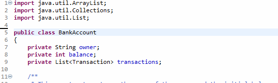
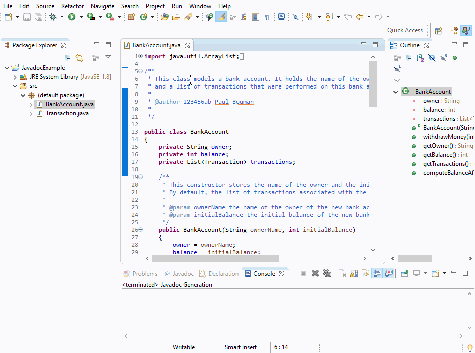

# FEB22012 Programming - Javadoc Guide

## Introduction

This documents contains a few pointers that explain how to write Javadoc in the FEB22012 Programming
course of the Erasmus School of Economics. The main aim of this is that you know where to put the Javadoc
in documents in a way that they are accepted by the Code Quality and Style checks.

## Examples

Suppose you have written the following class that models a bank account.

```{.java}
import java.util.ArrayList;
import java.util.Collections;
import java.util.List;

public class BankAccount
{
	private String owner;
	private int balance;
	private List<Transaction> transactions;
	
	public BankAccount(String ownerName, int initialBalance)
	{
		owner = ownerName;
		balance = initialBalance;
		transactions = new ArrayList<>();
	}
	
	public void withdrawMoney(int amount) throws IllegalArgumentException
	{
		if (amount > balance)
		{
			throw new IllegalArgumentException("Cannot withdraw "+amount+" with a balance of "+balance);
		}
		balance -= amount;
		Transaction transaction = new Transaction(amount, "Withdraw");
		transactions.add(transaction);
	}

	public String getOwner()
	{
		return owner;
	}

	public int getBalance()
	{
		return balance;
	}

	public List<Transaction> getTransactions()
	{
		return Collections.unmodifiableList(transactions);
	}
	
	public double computeBalanceAfterInterest(int periods, double rate) throws IllegalArgumentException {
		if (periods < 0) {
			throw new IllegalArgumentException("The number of periods can not be negative");
		}
		return balance * Math.pow(1+rate, periods);
	}
}
```

We should use Javadoc to comment the `class` and all `public` methods and constructors.

### Class Javadoc

The Javadoc for the class should be put directly before the `public class` keywords and thus after any import statements.
A Javadoc comment starts with `/**` and ends with `*/`, whereas a regular multi-line comment starts with `/*`. 
You should provide a description of the purpose of the class. Furthermore, the Javadoc should contain a line with an `@author`
tag, followed by your ERNA id (including the letters). After you ERNA id, you should write your name. For example:

```{.java}
import java.util.ArrayList;
import java.util.Collections;
import java.util.List;

/**
 * This class models a bank account. It holds the name of the owner, the current balance
 * and a list of transactions that were performed on this bank account.
 * 
 * @author 123456ab Paul Bouman
 *
 */

public class BankAccount
{
   // Class body here...
}
```

**Tip: ** In Eclipse, you can automatically generate the tags for a class, method or constructor if you put the cursor in the
spot where you want to create the Javadoc, type `/**` and press enter. An example of how this is done can be seen in the screencast
below:



### Constructor Javadoc and Param Tags

The constructor of the class has two arguments. When we write Javadoc for a constructor, we put it directly before the method
heaader of the constructor (and not within the body of the constructor). Note that the comment should be indented at the
same level as the method header. At the end of the Javadoc comment, for each argument
you should write a `@param` tag followed by the argument name an a short description of the argument. For example:

```{.java}
	/**
	 * This constructor stores the name of the owner and the initial balance of the bank account.
	 * By default, the list of transactions associated with the bank account is empty.
	 * 
	 * @param ownerName the name of the owner of the new bank account
	 * @param initialBalance the initial balance of the new bank account
	 */
	public BankAccount(String ownerName, int initialBalance)
	{
		owner = ownerName;
		balance = initialBalance;
		transactions = new ArrayList<>();
	}
```

### Constructors and Methods that may throw Exceptions

The rules for writing Javadoc comments for methods are the same as for constructors: they should be written directly before
the header of the method at the same level of indentation. If a method indications it can throw one or more exception types,
you should also at `@throws` tags describing these exceptions at the end of the Javadoc comment, similar to the `@param` tags
for the arguments. For example, the documentation of the `withdrawMoney` method that can throw an `IllegalArgumentException`
could look as follows:

```{.java}
	/**
	 * Performs the withdraw money transaction on this bank account. The transaction is only
	 * performed if there is sufficient balance on the account.
	 * 
	 * @param amount the amount of money to withdraw from the bank account
	 * @throws IllegalArgumentException if the amount exceeds the current balance of the account
	 */
	public void withdrawMoney(int amount) throws IllegalArgumentException
	{
		if (amount > balance)
		{
			throw new IllegalArgumentException("Cannot withdraw "+amount+" with a balance of "+balance);
		}
		balance -= amount;
		Transaction transaction = new Transaction(amount, "Withdraw");
		transactions.add(transaction);
	}
```

### Methods that return something

Up until now we only discussed constructors, that by definition return a reference to the newly constructed object, and a 
`void` method. When you write Javadoc comments for a method that produces some result, you should document this result using
the `@return` tag.  The `getOwner`, `getBalance` and `getTransactions` methods are methods that return something. They could
be documented as follows:

```{.java}
	/**
	 * Provides the owner associated with this bank account, that was provided during the creation
	 * of this bank account object.
	 * 
	 * @return the name of the owner of this bank account
	 */
	public String getOwner()
	{
		return owner;
	}

	/**
	 * Provides the current balance of this bank account. The current balance is the initial balance
	 * provided when the object was created adjusted by succesful transactions involving this bank
	 * account.
	 * 
	 * @return the current balance of the bank account
	 */
	public int getBalance()
	{
		return balance;
	}

	/**
	 * Provides the list of transactions that involve this bank account.
	 * 
	 * Note that this list cannot be modified.
	 * 
	 * @return an unmodifiable list of transactions involving this bank account.
	 */
	public List<Transaction> getTransactions()
	{
		return Collections.unmodifiableList(transactions);
	}
```

### Putting it all together

The method `computerBalanceAfterInterest` has arguments, a return value and may throw something. In such a case,
for all these aspects of the method documentation should be provided. Since Javadoc can be used to generate automatic
documentation, you are allowed to use some simple HTML tags to make the resulting documentation look nicer.
Examples are `<p>` and `</p>` to indicate the start and end
of a paragraph, `<em>` and `</em>` to indicate emphasis, `<strong>` and `</strong>` to indicate very important text,
or `<sup>` and `</sup>` to indicate superscript.

**Note** that in our course it is fine if you only write regular text in your Javadoc comments.

Putting everything together, an example Javadoc comment for the `computeBalanceAfterInterest` method could be:

```{.java}
	/**
	 * Computes the balance after applying a given interest rate for a number of periods.
	 * <p>
	 * It is assumed that interest is paid at the end of each period, and that the interest is compounded.
	 * </p>
	 * <p>
	 * The formula used for this is: balance &times; (1 + rate)<sup>periods</sup>
	 * </p>
	 * <p>
	 * <strong>Example:</strong> a bank account with a balance of 100 will become 110.25 after applying an interest
	 * of 0.05 for two periods.
	 * </p> 
	 * 
	 * @param periods the number of periods in which interest should be applied
	 * @param rate the interest rate applied in every period
	 * @return the balanced after the interest is applied for the number of periods to the current balance 
	 * @throws IllegalArgumentException if periods is smaller than zero
	 */
	public double computeBalanceAfterInterest(int periods, double rate) throws IllegalArgumentException {
		if (periods < 0) {
			throw new IllegalArgumentException("The number of periods can not be negative");
		}
		return balance * Math.pow(1+rate, periods);
	}
```

## Using Javadoc

Javadoc has two advantages: when you browser through an Auto-complete popup in Eclipse to find a method you want to call,
the Javadoc comments are automatically displayed, giving you useful information on what the method does and how you can use it.

Futhermore, you can use the `javadoc` tool that comes with the Java Developer Kit to generate nice looking documentation of your
classes based on the Javadoc comments you wrote. An example of how this looks for the `BankAccount` [can be seen here](BankAccount.html).

In Eclipse you can use the Javadoc tool via the `File` menu under the option `Export...`. In that menu, you must open the
`Java` category and choose `Javadoc`. In the next dialog you must make sure the `javadoc` tool is selected. If it is not
automatically selected, you should click `Configure` and point it to the `javadoc.exe` file in the `bin` folder of your
JDK installation. Finally, you can click `Finish`. Now the documentation is generated in a `doc` folder within your project.
Open the `index.html` in a web browser to view your generated documentation.



## Final Source Code

You can view the final source code of the `BankAccount` class on [GitHub](https://github.com/ErasmusUniversityAutolab/FEB22012-StyleGuide/blob/master/BankAccount.java).